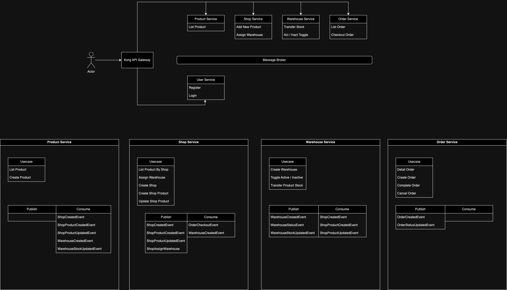

# eDot Microservices Monorepo Project

## Description
The project uses a monorepo structure with Git submodules, which simplifies both development and deployment processes. With a single Docker Compose file, the entire project, including the API Gateway, services, databases, Kafka, and more, can be deployed together. Additionally, each component can still be run or developed separately if needed.

This project uses the concept of Event-Driven Architecture, where each service operates independently without dependency on one another. The only connection between them is based on the events that are published or consumed.

Each service follows the principles of clean architecture, where every service has its own database tailored to the specific data requirements of its use cases.

## Architecture Overview



### Clone Project
```shell
git clone git@github.com:cmiwjaeger/edot-monorepo.git
```
```shell
cd edot-monorepo
```

### Pull all submodules
```shell
git submodule update --init --recursive
```

### Run docker command
```shell
docker-compose up
```
